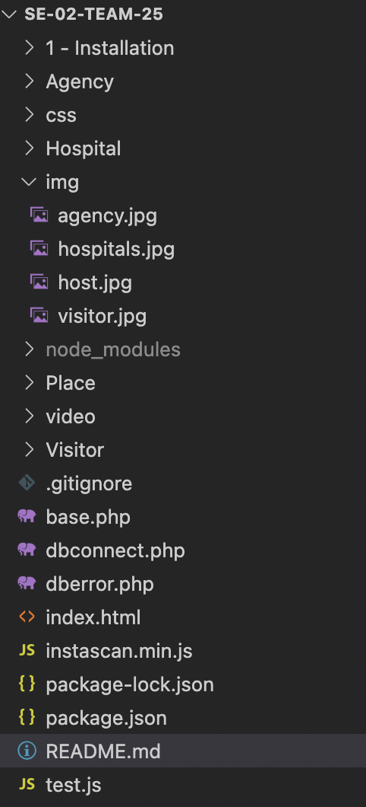

# SE-Sprint03-Team25

# Contributors
* Jona Bako
* Qais Qamhia

## Sprint 3 - Achievements

- [x] Fixed frontend and file organization inconsistencies (Document titles, non-overlapping Footer position, redirecting links, file naming, extensions etc.)

- [x] Modified user specific pages after registration/login with corresponding css files, qr.css for visitor and places, and maintenance.css for hospital and agency.

- [x] Used javascript and php to echo error messages from mysql with alert boxes as a default error template, 

- [x] Modified and sorted sql code in separate files for database creation, set up and data population.

- [x] Changed database connection method from local host to clamv by only using the credentials for seteam25, and doing the necessary changes to all php files, without the need of creating private credentials like used in the functionality of the previous sprint's project files.

- [x] Enabled users and places to only register and hospitals to only login, in accordance to project design.

- [x] Modified the register form for Visitors so that they can enter at least one of the contact attributes (email address and phone number).

- [x] Changed the authentication method to citizen id + password for already registered visitors who want to scan QR codes.

- [x] Changed the QR code for places from user specified to auto-generated, as well as set this attribute to NOT NULL in the sql code.

- [x] Created download button for the generated QR code after place registration / authentication.

- [x] Created profile page for Visitors, to view and change their data in the system if necessary.
 
- [x] Added log out buttons and corresponding php pages for logged in users. 

- [x] Added autocomplete for search bars in hospital and agent pages.

- [x] Added unit tests for frontend and backend.


You can find a working prototype for our project here:
http://clabsql.clamv.jacobs-university.de/~jbako

## Built with:
<ul>
  <li>HTML5</li>
  <li>JavaScript</li>
  <li>CSS3</li>
  <li>PHP</li>
  <li>MySQL</li>
</ul> 

### Note - QR Scan:

The webcam in the QR code scanning page will likely not load due to the supplied clamv link not being a secured site, thus please proceed with the following methods in order to enable functionality for this feature in Google Chrome, as the designated suitable browser:

<ul>
  <li>Type chrome://flags/#unsafely-treat-insecure-origin-as-secure in your address bar.</li>
  <li>Find and enable the <b>Insecure origins treated as secure</b> section.</li>
  <li>Add http://clabsql.clamv.jacobs-university.de/ to ignore the secure origin policy.</li>
  <li>Save and restart Chrome.</li>
</ul>

### Test Cases

We used a framework called Codeception to test our program. Codeception will perform tests on the application over clamv. So there is no need to create your own local database to test it on it.

To do tests you need to do the following steps:

1.1 Get the Testing/ folder on your local device

1.2 Navigate to testing directory

2. Open the terminal and run: ```composer require "codeception/codeception" --dev```

3. Run ```php vendor/bin/codecept bootstrap```

4. Move the test files from **our_tests** folder to **tests/acceptance**

5. In **tests** directory, change the url value in **acceptance.suite.yml** to http://clabsql.clamv.jacobs-university.de/~jbako

6. Finally, back in the **Testing** directory, run ```php vendor/bin/codecept run acceptance```

**Note:** The SignUp page tests may fail if data already exists in the Database. If that happens, either drop the database and run the sql scripts again, or try changing the details inside the test files into unique ones.
#

# SE-Sprint02-Team25

# Sprint 2
* Ujjwal Khadka
* Diego Zablah

## Sprint 2 Changes done

✅  Improved initial SQL file in '1 - Installation' folder.

✅  The place owners gets a QR code on logging.

✅  Visitors on logging are redirected to the scanning page.

✅  The visitor after scanning the QR code are redirected to the “You’re in” page.

✅  Agent can see the list of the visitors which are registered.

✅  Agent can see the list of the places owners which are registered.

✅  Agent can see the visitors' entry details like visitor id, place id, entry time and exit time.

✅  Agent can also search by visitor name.

✅  Added a .gitignore file.

✅  Added unit tests to test sing up and login routes of all 4 users.

✅  Added functionality for Hospitals; can see a list of visitors.

✅  Hospitals can search for any visitor, by using their first or last names, email, address or infection status.

✅  Hospitals can set the infected value of a visitor, which updates the backend data

✅  Hospitals can sort the columns of the displayed visitor table by descending or ascending order.

✅  Commented the entire code, including last sprint's code.

✅  Organized the code inside the files, making it easy to read.

✅  Renamed directories to more meaningful names.

✅  Added unit tests to test sing up and login routes of all 4 users.

✅  Updated routes within application.

 You can find a working prototype for our project here -  http://clabsql.clamv.jacobs-university.de/~ukhadka
  
  
  This prototype is only intended for a quick look at the front-end and testing the mechanics of the log-in and sign up. Updated version is available after full installation detailed below. This version is stable but temporary and is based of a now-modified back-end.


<h2>Built with</h2>
<ul>
  <li>HTML5</li>
  <li>JavaScript</li>
  <li>CSS3</li>
  <li>PHP</li>
  <li>MySQL</li>
  </ul> 
 
  <h2>Getting Started</h2>
  <h3>Pre-requisites</h3>
    
  * [XAMP](https://www.apachefriends.org/download.html) -- or equivalent service to host local server</li>
  * Most suitable browser(s) -- Chrome/Firefox</li>
    
    
   <h3>Installation</h3>
    <ol>
      <li>Clone Repository to your local machine</li>
      <li>Open Installation folder</li>
            <li>Run the sql script within local://phpmyadmin or equivalent (Import file into XAMPP, or source Database and User Installation Script.sql)</li>
            <li>Move all folders (installation folder not neccesary at this point) to htdocs under XAMPP</li>
      <li> Run XAMPP and start all services</li>
  <li> Return to main page and hit "Open Application"</li>
    </ol> 
      
    
 <h1>File Structure</h1>
 <h3> General Information to Helo Process Above Image</h3>
Each Directory is named after the 4 different entities (Visitor, Agency, Hospital, Place). The files respecting each entity should be found inside.
dbconnect.php and dberror.php manage the database connection and error handling respectively.
Some media files are included in directories img and video. These are particularly used throughout the Front-End UI.




<h3>Testing</h3>

The tests were written using a javascript framework called mocha and Chai. In order to test it for your environment please follow the link and follow each step until reaching the step that says "Run the test:" from there do not run that "npm test" command but instead just type in the terminal "mocha" on the root directory of our project folder. From there you will get all the test cases done. For us it passed 5/5 test cases

The link for mocha installation : https://medium.com/@jmin499/mocha-chai-db8c7b4cf3b3

Furthermore as for the other test cases. We can start from the backend test cases done in Php
Where if you go to our website and perform a register in any section (except Hospital because it requires special registration form provided by Agent which will be added in later on sprints), you should get a confirmation of registration in plain text in a php file saying successfully registered. Also you can check the database after performing one and observe the changes and insertion of a new record containing the data you added. 

As for the log-in forms, we performed a test case via Php where you can use login credentials for any of the sections which you can get from the database and then use in the form and after a successful login has been submitted you will be re-directed to a Php file confirming your successful log-in attempt. If not not logged in you will also get an error implying that you couldn't log-in.

Another Test case referring to front-end components was relating to the overall display of our webpage in different servers (clamV,local server) to see if everything was working fine including the testing in different types of devices to check for proper render of our website components. Everything worked well, as required.


Please install these npm packages to run tests in routes by using these commands:

```
$ npm i
```
```
$ npm i should request
$ npm i chai
$ npm i jsdom
$ npm i chai-dom
$ npm i jsdom-global
```
And to run tests:

```
mocha
```

If an error similar to : "Error: Cannot find module 'example'" occurs, run the following:
```
$ npm i example
``` 


<h1>Sprint 1</h1>
<h2>Contributors</h2>
<ul>
  <li>Vahid Menu Nesro</li>
  <li>Valdrin Smakaj</li>
</ul>
<h1>SPRINT 1 Acheivements</h1>

✅ Created Landing page using HTML and CSS

✅ Implemented Database Design in MySQL and included specified relational constraints

✅ Created SQL Script to increase modularity during development step

✅ Implemented Database Connection using PDO API in order to simplify Data Sanitization

✅ Sanitized Input Forms

✅ Implemented Visitor Registration and Login.

✅ Implemented Place Registration and Login.

✅ Implemented Hospital Login.

✅ Implemented Agency and Login.

✅ Added project installation guide to README.

✅ Created Database User and included it in SQL Script.

✅ Added 5 front end test cases in where each one of them tests whether in our index page of our website text content of our components are rendered well without any errors. You can also further more see each by checking our script in our test.js file.

In short, we implmented the front-end for the landing page and registration and login pages for all users. We also laid-down the back-end as well as a framework for handling the database connection inside dbconnect.php. Additonality, we formatted the code to make it modular using, SQL scripts and minimizing the amount of external dependencies to run our code base. We finally tested our DOM using.

